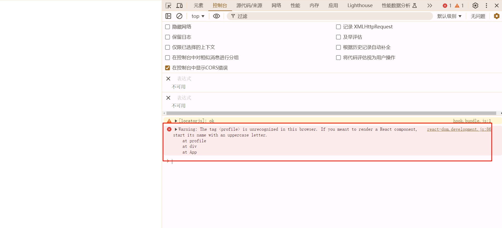
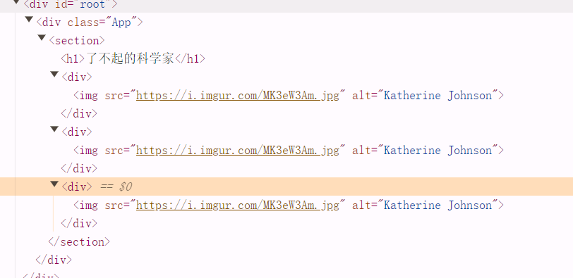
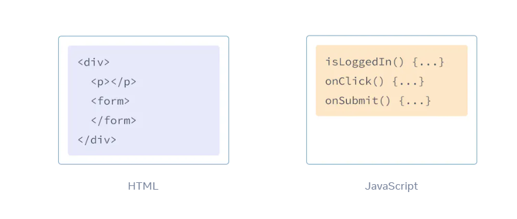

# React 学习笔记

- **版本**: React 18.3.1
- **官网**: [React 官方文档](https://zh-hans.react.dev)
- **本仓库 Node 版本推荐**: v18.20.4
- **启动**:**pnpm dev** start 被我改成了 dev

### React 基本介绍

React 起源于 Facebook 的内部项目，因为当时市场上的所有 JavaScript MVC 框架都无法完全满足他们的需求。于是，Facebook 决定开发一个专门用于构建用户界面的 JavaScript 库，最初用于架设 Instagram 的网站。

React 的核心是构建用户界面的组件化库。它专注于高效地更新和渲染用户界面，并以其独特的设计理念和出色的性能迅速得到了广泛的关注和使用。React 于 2013 年 5 月开源，由于其逻辑简洁、高性能的特点，越来越多的开发者开始关注并采用它。

##### 核心理念：UI = fn(state)

在 React 中，用户界面（UI）可以简单地表示为 `UI = fn(state)`，其中：

- **state** 代表应用程序的当前状态，包括用户输入、数据等。
- **fn** 是一个函数，它根据 `state` 来生成或更新 UI。
- **React** 负责实现这一逻辑，当 `state` 变化时，React 会自动重新渲染（或更新）UI，使开发者无需手动操作 DOM，只需专注于如何描述 UI。

这种设计使得 React 成为一个革命性的工具，推动了前端开发的进步，越来越多的开发者将它视为未来 Web 开发的主流工具。

随着项目的不断发展，React 已从最初的 UI 引擎演变为前后端通用的 Web 应用解决方案。React 从诞生至今，持续给开发者带来各种惊喜。自 2015 年起，每年都会举行 React Conf 大会，介绍当年的新特性和发展方向。


- **React Conf 官网**: [https://conf.reactjs.org/](https://conf.reactjs.org/)
- **React Conf YouTube 频道**: [https://www.youtube.com/channel/UC1hOCRBN2mnXgN5reSoO3pQ](https://www.youtube.com/channel/UC1hOCRBN2mnXgN5reSoO3pQ)

#### 重要版本更新

以下是 React 几个重要版本的重大更新：

- **React 16**:

  - 引入了 **Fiber** 架构，使得更新变得可中断、可分片，并具有优先级管理。

- **React 16.8**:

  - 推出了 **Hooks**，标志着从类组件正式过渡到函数组件，使得函数组件可以拥有状态和副作用。

- **React 17**:

  - 作为过渡版本，没有添加面向开发人员的新功能，主要侧重于**升级和简化 React 的内部实现**，为未来版本的改进打下基础。

- **React 18**:
  - 引入了 **Concurrent Rendering**，使 React 能够在后台准备更新，并在用户交互时立即更新界面。
  - **Transition API**: 帮助管理 UI 的优先级更新，改善用户体验。
  - **Suspense**: 提升了对异步操作的支持，允许开发者在数据加载时展示占位符内容。
  - **新的 Hooks**: 如 `useTransition`、`useDeferredValue` 等，为开发者提供更多控制渲染行为的工具。
  - **Offscreen**: 允许组件在后台渲染和保持状态，即使它们当前在屏幕上不可见。

#### 搭建开发环境

虽然官方提供了通过 _CDN_ 引入 _React_ 的方式：*https://zh-hans.reactjs.org/docs/cdn-links.html*

但是实际开发中肯定是使用 _React_ 的脚手架工具来搭建项目，_React_ 官方提供了脚手架工具 _Create React App_：

*https://create-react-app.dev/*

快速开始：

```js
npx create-react-app my-app
cd my-app
npm start
```


### 描述 UI

#### 我的第一个组件

##### 定义组件

```js
// 定义一个名为 Profile 的函数组件
function Profile() {
  // 这里是 JSX 代码，通过 Babel 转译后可以理解为返回的 HTML 标签，准确地说是 React 元素
  return (
    // 返回的 JSX 标签
    
  );
}
```

> **注意**:
> - React 组件是普通的 JavaScript 函数，但组件的名称必须以大写字母开头。
> - 如果 `return` 语句不加括号，`return` 语句下方紧接的代码将被忽略！




#### 浏览器所看到的



> React 通过元素名称的大小写来判断它是原生 HTML 元素还是自定义的 React 组件：

- `<section>` 是小写的，所以 React 知道我们指的是 HTML 标签。
- `<Profile />` 以大写字母 `P` 开头，所以 React 知道我们使用的是自定义的 `Profile` 组件。

#### 嵌套和组织组件

> **重要提醒**: 不要在一个组件的定义内部嵌套另一个组件的定义。

```javascript
export default function Gallery() {
  // ❌ 永远不要在组件内部定义另一个组件
  function Profile() {
    // ...
  }
  // ...
}
```

##### 为什么这样做会有问题？

1. **性能问题**:
   - 每次 `Gallery` 组件重新渲染时，React 都会重新定义 `Profile` 组件。这意味着每次 `Gallery` 渲染时，`Profile` 组件都会被重新创建。这不仅增加了不必要的性能开销，还可能导致性能下降，尤其是在组件频繁更新的情况下。

2. **Bug 的产生**:
   - 如果 `Profile` 组件包含状态或副作用（例如使用 `useState` 或 `useEffect`），每次 `Gallery` 重新渲染时，这些状态或副作用都可能被重新初始化或重新执行，导致一些难以预测的行为或 Bug。

```javascript
// ✅ 在顶层声明组件
function Profile() {
  // ...
}

export default function Gallery() {
  // ...
}
```

##### 为什么在顶层定义组件更好？

1. **组件只定义一次**:
   - 当你在顶层定义 `Profile` 组件时，它只会被定义一次。每次 `Gallery` 组件重新渲染时，React 都会使用相同的 `Profile` 组件实例，这避免了不必要的性能开销。

2. **状态和副作用的稳定性**:
   - 在顶层定义组件可以确保 `Profile` 的状态和副作用不会因为 `Gallery` 的重新渲染而被重新初始化。这种方法更加符合 React 的最佳实践，确保了组件行为的稳定性和可预测性。

##### 导出和导入一个组件 

在 React 中，组件的导出和导入方式与 JavaScript 中的模块导入和导出方式一致。无论是使用 `'./Gallery.js'` 还是 `'./Gallery'` 作为模块路径，在 React 中都能正常工作，只是前者更符合原生 ES 模块的规范。

React 组件通常有两种导出方式：**默认导出** 和 **具名导出**。

######  默认导出（Default Export）

默认导出用于导出单一值，导出时不需要指定名称，导入时可以为导入的模块自定义名称。

```javascript
// Gallery.js
export default function Gallery() {
  return <div>Gallery Component</div>;
}

// 导入时可以为组件起任意名字
import GalleryComponent from './Gallery';

function App() {
  return <GalleryComponent />;
}
```

- **优点：** 适合导出单个主组件或主函数，导入时可以自定义名称，方便使用。
- **缺点：** 不能在一个模块中导出多个默认值；因为导入时名称是自定义的，容易导致代码的一致性和可读性问题。

##### 具名导出（Named Export）

具名导出允许在一个模块中导出多个变量或函数，导入时需要使用相同的名称。

```javascript
// Gallery.js
export function Gallery() {
  return <div>Gallery Component</div>;
}

// 也可以导出其他组件或函数
export function Thumbnail() {
  return <div>Thumbnail Component</div>;
}

// 导入时需要使用导出的名称
import { Gallery, Thumbnail } from './Gallery';

function App() {
  return (
    <>
      <Gallery />
      <Thumbnail />
    </>
  );
}
```

- **优点：** 适合导出多个组件或函数，导入时可以选择性地导入需要的部分，有助于代码的模块化和可维护性。
- **缺点：** 导入时必须使用导出的名称，可能会导致命名冲突；在大型项目中可能不如默认导出直观。

###### 对比总结

- **默认导出：** 适用于模块只导出一个主要内容的场景，导入时的命名更灵活，但可能会影响代码一致性。
- **具名导出：** 适用于模块内有多个导出内容的场景，导入时需严格匹配名称，有助于清晰地了解模块内容和依赖关系。

#### 使用 JSX 书写标签语言

> JSX 是 JavaScript 的语法扩展，让用户在 JavaScript 文件中书写类似 HTML 的标签。通过 Babel 转译，JSX 可以被转换为 JavaScript 代码，以在浏览器中运行。

##### JSX: 将标签引入 JavaScript!




##### 将 HTML 转化为 JSX

以下是一个示例，展示了如何将传统的 HTML 代码转换为 JSX 代码。注意，HTML 中的一些属性在 JSX 中需要做相应的调整，比如 `class` 属性需要改为 `className`。

```html
<!-- 传统 HTML 代码 -->
<h1>海蒂·拉玛的待办事项</h1>

<ul>
    <li>发明一种新式交通信号灯</li>
    <li>排练一个电影场景</li>
    <li>改进频谱技术</li>
</ul>
```

以下是将上述 HTML 转化为 JSX 的代码：

```jsx
// APP.js

export default function TodoList() {
  return (
   <>
    <h1>海蒂·拉玛的待办事项</h1>
    
    <ul>
      <li>发明一种新式交通信号灯</li>
      <li>排练一个电影场景</li>
      <li>改进频谱技术</li>
    </ul>
   </>
  );
}
```

#### JSX 规则

1. **只能返回一个根元素**:
   - 在 JSX 中，每个组件的 `return` 语句只能返回一个根元素。通常，开发者使用一个 `<div>` 或者 `<React.Fragment>` (`<>` 的简写形式) 来包裹所有的子元素。例如，上述代码中使用了 `<>` 来包裹所有 JSX 标签。

2. **标签必须闭合**:
   - 所有的 HTML 标签必须闭合，即使是自闭合的标签（例如 ``）也需要使用自闭合的形式：``。如果标签没有正确闭合，JSX 代码将无法正常工作。

3. **使用驼峰式命名法**:
   - 在 JSX 中，HTML 属性名使用驼峰式命名法，例如 `class` 应写为 `className`，`onclick` 应写为 `onClick`。这是因为 JSX 中的属性名实际上对应的是 JavaScript 对象的属性，而 JavaScript 的属性命名习惯是使用驼峰式的命名法。